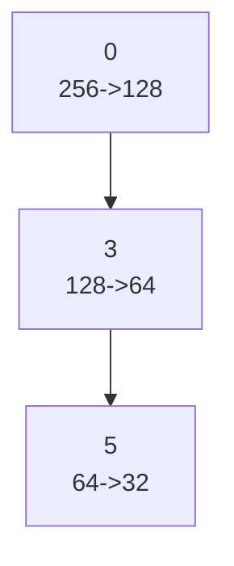

# MemoryNetwork Neural Network
## Description
Manages memory formation, storage, and retrieval.
## Architecture Visualization
![[attachments/MemoryNetwork_architecture_20250221_001857.png]]
## Weight Distributions
![[attachments/MemoryNetwork_weights_20250221_001857.png]]
## Activation Heatmap
![[attachments/MemoryNetwork_activation_20250221_001857.png]]
## Network Statistics
```json
{
  "layers": [
    {
      "name": "0",
      "type": "Linear",
      "in_features": 256,
      "out_features": 128
    },
    {
      "name": "3",
      "type": "Linear",
      "in_features": 128,
      "out_features": 64
    },
    {
      "name": "5",
      "type": "Linear",
      "in_features": 64,
      "out_features": 32
    }
  ],
  "total_parameters": 43232,
  "trainable_parameters": 43232,
  "layer_sizes": [
    128,
    64,
    32
  ]
}
```
## Mermaid Diagram

## Connections
- [[Development/README|Development]] - Network evolution
- [[Memories/README|Memories]] - Memory patterns
- [[Language_Learning/README|Language Learning]] - Language processing

## Recent Updates
```dataview
TABLE created as "Time", tags as "Tags"
FROM "#neural_network" and [[MemoryNetwork]]
SORT created DESC
LIMIT 5
```
