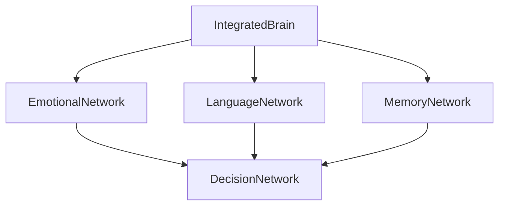

# Neural Network Overview

This document provides an overview of all neural networks in the system.

## Network List
- [[IntegratedBrain]]
- [[EmotionalNetwork]]
- [[LanguageNetwork]]
- [[MemoryNetwork]]
- [[DecisionNetwork]]

## Network Graph


## Recent Changes
```dataview
TABLE file.mtime as "Last Modified"
FROM "Network"
WHERE file.name != "README" and file.name != "index"
SORT file.mtime DESC
```
